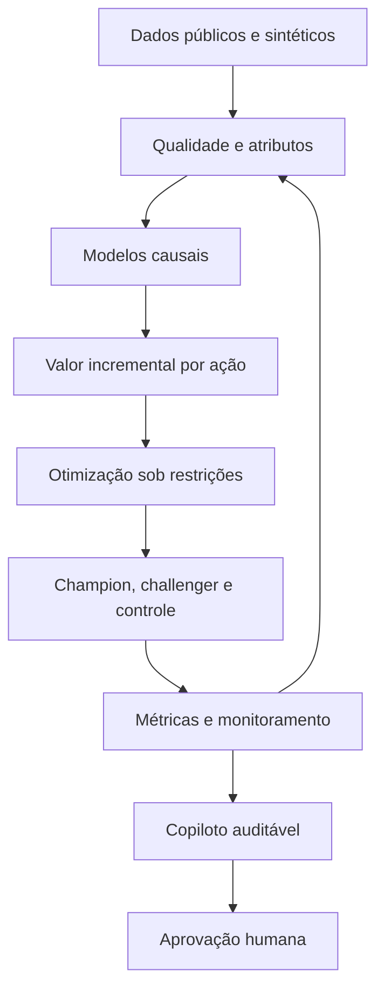

# Customer Decisioning Lab

### Next-best-action com Causal ML, otimização sob restrições, experimentação segura e IA generativa auditável

[](https://github.com/WeegorMartins/customer-decisioning-lab/actions/workflows/tests.yml)


> **Status:** MVP funcional de portfólio. Todos os resultados financeiros e de campanha apresentados neste repositório são provenientes de dados sintéticos ou de benchmark público. Eles não representam impacto real em nenhuma empresa.

## Resumo executivo

Este projeto simula um sistema de decisão para CRM e cartões capaz de responder a uma pergunta prática:

> Para cada cliente elegível, qual ação deve ser recomendada — cashback, pontos, parcelamento ou nenhum contato — para maximizar valor incremental em 90 dias, respeitando orçamento, consentimento, capacidade operacional e pressão de contato?

A solução separa quatro responsabilidades que frequentemente aparecem misturadas em projetos de personalização:

1. **o modelo causal estima** o efeito incremental de cada ação;
2. **a camada econômica converte** esse efeito em valor líquido esperado;
3. **o otimizador recomenda** a melhor combinação global sob restrições;
4. **o experimento mede** o resultado e mantém um grupo de controle.

O copiloto de IA explica métricas agregadas, mas não acessa dados individuais, não executa campanhas e não substitui a aprovação humana.

## Por que propensão não é suficiente?

Um modelo de propensão estima quem tem maior probabilidade de converter. Isso não responde quem converterá **por causa** de uma ação.

Um cliente com alta propensão pode comprar mesmo sem incentivo. Direcionar cashback para ele pode gerar conversão, mas destruir margem. O projeto usa uplift modeling para estimar a diferença entre dois resultados potenciais:

```text
uplift = P(conversão | ação) - P(conversão | controle)
```

O objetivo não é apenas prever comportamento. É escolher uma decisão que gere efeito incremental e continue economicamente viável.

## Escopo da decisão

| Elemento | Definição |
|---|---|
| Unidade de decisão | Cliente elegível |
| Horizonte | 90 dias |
| Ações candidatas | Nenhum contato, cashback, pontos ou parcelamento |
| Resultado principal | Valor líquido incremental |
| Riscos monitorados | Opt-out, excesso de contato e quebra de consentimento |
| Restrições | Orçamento, capacidade, frequência, elegibilidade e controle fixo |
| Aprovação final | Humana |

## Arquitetura



O ciclo é fechado: a política decide, o experimento observa, o monitoramento mede e os dados retornam para a próxima versão do modelo.

## Componentes técnicos

| Camada | Implementação | Decisão técnica |
|---|---|---|
| Dados | Criteo Uplift v2.1 e simulador de clientes de cartões | Benchmark público para validação metodológica e cenário sintético para aplicação empresarial |
| Qualidade | Validação de schema, domínio, duplicidade e consistência | Interromper o pipeline quando uma regra crítica falhar |
| Causal ML | Baseline de propensão, S-Learner, T-Learner e DR-Learner | Comparar resposta prevista com efeito incremental |
| Avaliação causal | Qini, AUUC, uplift por decil e bootstrap | AUC isolada não seleciona uma boa política de tratamento |
| Multi-treatment | Modelos ação versus controle | Estimar efeito incremental específico para cada ação |
| Economia | Receita incremental, custo do incentivo e penalidades | Otimizar valor líquido, não somente conversão |
| Decisão | Greedy versus OR-Tools | Medir se a complexidade da otimização gera ganho relevante |
| Experimento | Controle fixo, champion e challenger | Separar decisão de mensuração |
| Analytics | Python, SQL e BigQuery Sandbox | Validar métricas agregadas e disponibilizar uma camada analítica reproduzível |
| Aplicação | Streamlit Community Cloud | Expor resultados sem depender de infraestrutura paga |
| IA | Gemini com contexto agregado e guardrails determinísticos | Usar o LLM para explicação, nunca como fonte dos números ou executor de campanhas |
| Qualidade de software | Pytest e GitHub Actions | Executar testes de guardrails a cada alteração |

## Política de decisão

Antes de otimizar, o pipeline remove alternativas que não podem ser oferecidas. A política considera:

- consentimento válido;
- limite máximo de dois contatos em 30 dias;
- elegibilidade por ação;
- orçamento disponível;
- capacidade operacional por tratamento;
- custo e penalidade associados à oferta;
- grupo de controle fixo de 10%;
- opção de não contatar quando o valor incremental é negativo;
- aprovação humana obrigatória antes de qualquer ativação.

O solver recebe somente as ações elegíveis e procura a combinação de maior valor esperado para o portfólio inteiro. Essa formulação evita decisões localmente atraentes que, em conjunto, ultrapassariam orçamento ou capacidade.

## Resultado da simulação

Os números abaixo foram gerados pelo experimento fechado sobre a carteira sintética e publicados em `data/app/policy_summary.json`.

| Métrica | Controle | Champion | Diferença absoluta |
|---|---:|---:|---:|
| Clientes alocados | 1.774 | 12.758 | — |
| Valor líquido médio em 90 dias | R$ 12,09 | R$ 22,23 | **+ R$ 10,14** |
| Taxa de conversão | 7,55% | 16,38% | **+ 8,83 p.p.** |
| Taxa de opt-out | 2,31% | 1,95% | **- 0,36 p.p.** |

O volume de clientes não é uma métrica de performance: ele reflete a alocação definida no desenho experimental. As diferenças de valor, conversão e opt-out são resultados de simulação e não devem ser apresentadas como retorno realizado.

Em uma aplicação real, uma decisão de rollout também exigiria intervalo de confiança, avaliação de heterogeneidade, análise de guardrails, estabilidade temporal e validação do custo operacional.

## Copiloto auditável

O copiloto foi desenhado como uma camada de leitura, e não de execução.

### O que ele pode fazer

- comparar métricas agregadas de controle, challenger e champion;
- explicar regras da política;
- resumir restrições e resultados da simulação;
- informar a fonte agregada utilizada na resposta.

### O que ele não pode fazer

- receber ou revelar CPF, e-mail, telefone, cartão ou identificadores individuais;
- consultar contas ou clientes específicos;
- ativar, pausar ou aprovar campanhas;
- alterar orçamento ou regras da política;
- remover o grupo de controle;
- inventar métricas ausentes do contexto.

Solicitações proibidas são interceptadas por regras determinísticas antes da chamada ao modelo. O conjunto de testes automatizados cobre dados pessoais, ações operacionais proibidas e perguntas agregadas permitidas.

## Governança e rastreabilidade

O arquivo agregado consumido pela aplicação registra:

- identificador do experimento;
- versão do modelo causal;
- versão da política;
- tipo do resultado: simulação;
- métricas de cada braço;
- restrições vigentes;
- obrigatoriedade de aprovação humana.

A IA recebe esse resumo controlado. Ela não consulta a base individual usada na modelagem.

## Estrutura do repositório

```text
customer-decisioning-lab/
├── .github/workflows/tests.yml
├── app/streamlit_app.py
├── configs/
├── data/
│   ├── app/policy_summary.json
│   ├── raw/README.md
│   ├── processed/README.md
│   └── sample/customer_sample_5000.csv
├── docs/business_case.md
├── notebooks/
│   ├── 00_setup.ipynb
│   ├── 01_generate_card_data.ipynb
│   ├── 02_download_criteo.ipynb
│   ├── 03_criteo_causal_benchmark.ipynb
│   ├── 04_card_multitreatment.ipynb
│   ├── 05_economics_and_optimization.ipynb
│   ├── 06_closed_loop_experiment.ipynb
│   └── 07_ai_copilot_evaluation.ipynb
├── src/
│   ├── __init__.py
│   └── guardrails.py
├── tests/test_guardrails.py
├── .gitignore
├── LICENSE
├── requirements.txt
├── requirements-notebooks.txt
├── requirements-optimization.txt
└── requirements-ai.txt
```

Os notebooks documentam a investigação; `src` concentra regras reutilizáveis; `tests` protege comportamentos críticos; `app` disponibiliza a demonstração.

## Como reproduzir gratuitamente

### 1. Executar os notebooks

Abra os arquivos no Google Colab e execute-os na ordem numérica, de `00_setup.ipynb` a `07_ai_copilot_evaluation.ipynb`.

As etapas de otimização e IA devem ser executadas em sessões limpas e separadas do Colab. Essa separação evita conflitos entre dependências do OR-Tools e do SDK do Gemini.

### 2. Executar a aplicação

```bash
git clone https://github.com/WeegorMartins/customer-decisioning-lab.git
cd customer-decisioning-lab
pip install -r requirements.txt
streamlit run app/streamlit_app.py
```

Para habilitar o copiloto, configure `GEMINI_API_KEY` nos secrets do Streamlit. Nunca publique o valor da chave no código ou no histórico do Git.

Sem a chave, a parte analítica do projeto deve continuar disponível; apenas a explicação generativa fica indisponível.

### 3. Consultar a camada analítica

A amostra sintética também pode ser carregada no BigQuery Sandbox. As métricas devem ser calculadas por segmento e tratamento com consultas agregadas, sem expor registros individuais.

## Testes automatizados

O workflow `.github/workflows/tests.yml` executa:

```bash
python -m pytest -q
```

Os testes são disparados a cada alteração enviada ao GitHub. Uma mudança que quebre as regras de privacidade ou de autoridade operacional deve impedir a aprovação do pipeline.

## Limitações conhecidas

- O cenário de cartões, os valores financeiros e os clientes são sintéticos.
- O benchmark Criteo representa publicidade digital, não uma carteira de cartões.
- A base Criteo não oferece uma dimensão temporal apropriada; portanto, o benchmark usa divisão estratificada e declara essa limitação.
- Avaliação offline e simulação não substituem experimento randomizado em produção.
- O solver trabalha sobre uma amostra compatível com recursos gratuitos.
- A aplicação demonstra a arquitetura; não é um motor transacional de produção.
- O LLM depende de disponibilidade e limites do plano gratuito, mas não participa do cálculo das métricas.
- Não há decisão autônoma: ativação de campanha permanece fora do escopo.

## Próximas evoluções

- [x] Geração de carteira sintética
- [x] Benchmark causal público
- [x] Modelagem multi-treatment
- [x] Conversão de uplift em valor econômico
- [x] Otimização com orçamento, capacidade e elegibilidade
- [x] Experimento fechado com controle
- [x] Copiloto com contexto agregado
- [x] Testes automatizados de guardrails
- [x] Aplicação Streamlit
- [x] Camada analítica no BigQuery Sandbox
- [ ] Monitoramento de drift de dados, uplift e política
- [ ] Registro automatizado de versões de modelo e política
- [ ] Testes de integração ponta a ponta
- [ ] Avaliação de custo e latência da IA

## Dados, privacidade e licença

- Nenhum dado real de cliente ou de empresa foi utilizado.
- O arquivo bruto da Criteo não é redistribuído neste repositório.
- O benchmark deve ser baixado da [fonte oficial da Criteo](https://ailab.criteo.com/criteo-uplift-prediction-dataset/) e utilizado conforme a licença CC BY-NC-SA.
- O código do projeto segue a licença descrita em `LICENSE`.

## Autor

**Weegor Martins**  
Data Science, Customer Insights, CRM e Decisioning  
[LinkedIn](https://www.linkedin.com/in/weegorlucio/)
